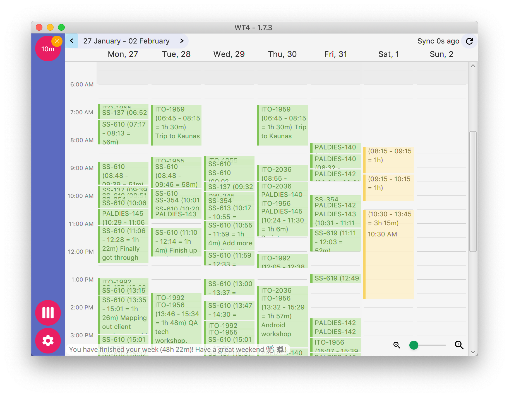

# Just another work tracker for JIRA - WT4

# What is it?

Long story short, it&rsquo;s a desktop application, that helps you out to track work time and synchronize with JIRA work logs.

It is no secret, that more and more companies have a culture, where employees are tracking their work time in JIRA.

And when you think about it, *it makes a lot of sense*.

-   It saves you a headache and conflict situations when a client does not know what he is paying for
-   It helps you, as a user have left your work last Friday
-   It keeps you honest, how much time you have spent through a week. This one is a lifesaver for me. I always have something throughout the week, where I&rsquo;m helping my mom or my wife in the city.

Also, it is no secret, *that tracking work is one of the more tedious parts of work*. It may even be a &rsquo;pain&rsquo; for someone, to do this work daily.

That is where my tool comes into place. Interested? Read on 🚀

# TLDR;

Already sold on the idea and just want to try it?

-   [Download the app from here 👈](https://github.com/marius-m/wt4/releases)
-   Install it, as a regular application you would
-   Log into your JIRA account
-   Start trackin&rsquo;

Not in the mood to install anything? You could check out the video I&rsquo;ve made on how the app looks like and its basic functionality 🎥 👇

<iframe width="1549" height="796" src="https://www.youtube.com/embed/Co-Apdwao1M" title="YouTube video player" frameborder="0" allow="accelerometer; autoplay; clipboard-write; encrypted-media; gyroscope; picture-in-picture" allowfullscreen></iframe>

# Why

*So*, why this tool and not something else? Especially, when there are quite a few, that are solving exactly the same problem.

Well, to be honest, I can&rsquo;t answer that *for you*. But I may try listing out my own challenges I&rsquo;ve been trying to solve. Just maybe, some of the pains will align with yours.

# My challenges

-   **Logging in browser sucks**. There, I&rsquo;ve said it. Apart from the problem, that I have more tabs open than I can count. Okay, I may be exaggerating here, but who counts more than ten nowadays?🤔
-   **It is terribly inaccurate**. If you&rsquo;re only using JIRA tools, good luck my friend. You have to remember when you have started your work or how much it took. And quite frankly, there is a possibility you&rsquo;ll still be ways off.
-   **Can&rsquo;t alt-tab**. What is this? 1994? There seem to be *too many applications, that are focused on using mainly the mouse to accomplish work*. Where are the shortcuts for the apps that we use often?
-   **Can&rsquo;t work offline**. I know, I know, it is not so much of a problem nowadays, then it was before. But do we really need an internet connection always active, just to do our work? And what happens if that connection just vanishes for a day?

Now that you have a brief idea of the main pains, maybe let us try to remedy some of them. And here comes the tool I&rsquo;ve been building the hype for.

# The tool

WT4 is a desktop application. You download it, install it on your machine and use it.

It has managed to live through multiple iterations of programming languages, the operating system supports, GUI frameworks, and just being plain ugly. Also, it has managed to reach the sunlight from my garage.

I&rsquo;ve been working on this tool for quite some time and *it has been my [&rsquo;eating my own dog food&rsquo;](https://en.wikipedia.org/wiki/Eating_your_own_dog_food) situation*. For the biggest part of its life, I&rsquo;ve been using it only on my own, until some of my colleagues asked to try it out.

It solves most of the challenges I&rsquo;ve listed above.

-   **Focused**. The tool has only one job. To ease the pain to log your work. Create a work log, map it to JIRA ticket and you&rsquo;re done.
-   **Power tool**. It is designed to be at the tip of your fingers. &rsquo;Alt + tab&rsquo; to reach it. It has most of the shortcuts to log your work without even using a mouse. When you&rsquo;re familiar with it enough, it&rsquo;ll take you literally seconds to log work and proceed with your work.
-   **Adaptive**. Create / update / delete work logs however you like, it&rsquo;ll take care, that logs get to JIRA tickets on their own. It also works on any major operating system. I&rsquo;m pretty sure you can run it on *toaster*, if you&rsquo;ll manage to install it.
-   **Resilient**. As promised. *It runs offline*. I even know people, who log time, throughout the week and only to synchronize with JIRA on Friday. Is it a good idea? No. Can you do it? Yes.
-   **Open**. It is open-source. You can check how it works. Or just modify it and run it on your own. No really, you can use it however you feel like it.

One important thing to mention is, **WT4 is not a replacement for JIRA**. It is designed to be used alongside JIRA complementary, to help in dealing with daily activities.

# Drawbacks

Of course, as with all the tools, it is not all flowers and rainbows.

-   **Computer resource**. The framework that I&rsquo;m using is a bit &rsquo;big&rsquo; for how little the app is actually doing. With time, this will diminish (when the technology and my coding skills improve). If you&rsquo;re not a technical person, this is not a concern. If you&rsquo;re a geek, I would not suggest you opening process tools to check how much ram system uses 🙈.
    
    

-   **Desktop application**. I know I&rsquo;ve managed to list this as a pro, not a con. But the reality is it has its own drawbacks. App does not update itself. At least for now. If you have an old version or a bug, you&rsquo;ll need to update the app yourself.

-   **Steep learning curve**. I would not call the app &rsquo;easy to use&rsquo; or &rsquo;intuitive&rsquo; by no means. I&rsquo;ve been working on this app on my own, me being the main user. I&rsquo;m a geek, that uses command-line tools for most of my work, so you probably get the drift, how I understand UI/UX.
    
    I&rsquo;m planning to create a wiki or other learning material to get around this. Or in time, buy some beer for our [UI](https://www.linkedin.com/in/sandra-pipirait%C4%97-navickien%C4%97-603b1853/) and [UX](file:///) masters [in our company](https://www.ito.lt/) in due time.

# Use case scenarios

Still figuring, is this actually useful for your use case? I&rsquo;ll throw in some scenarios, that may or may not apply to you.

-   **You are starting your work, however, the project manager didn&rsquo;t have time to create a ticket where to log time.** No problem, you can synchronize to JIRA, whenever you&rsquo;re ready, all work logs are stored on your computer.
-   **You are working with two JIRAs. One is of your company&rsquo;s, another is one on client&rsquo;s side.** A bit more complicated case, though still doable. Log on one JIRA, then export work logs. Change app profile to your client&rsquo;s one and import work logs back in. You&rsquo;ll have a direct mirror copy.
-   **JIRA is temporary down.** I agree, this does not happen too often. However, it does not even hinder your work, you just work as you would. When JIRA is back up, just synchronize the work logs.
-   **You are just starting out work WT4. Most of your work logs are in JIRA already**. Easy, just log into JIRA and press &rsquo;Sync&rsquo;. It will synchronize with JIRA. If you don&rsquo;t like the app and decide to use something else, all work logs are on JIRA anyway.
-   **You have work logs that are with incorrect duration. And work logs should have been on Friday, not on Thursday**. Easy. WT4 has a calendar, that works as.. well a regular calendar. Press and hold &rsquo;alt&rsquo;, drag the work logs where they should be. Keep holding &rsquo;alt&rsquo; and scale work logs with the time you think it should be.
-   **You have started your work. But in the middle of it, you had to fix one crucial bug on a different project. On top of it, you forgot to start / stop timer**. Actually, this is where the WT4 shines. Because it adapts to various work styles, you can &rsquo;split&rsquo; the work log into multiple ones.

There are quite a few people that are using WT4. And what makes it interesting, as far as I have seen, every each person has their own way of using it.

# The gauntlet

In our [company](https://www.ito.lt/), we have a long history of logging all of our work to JIRA with pretty precise time. I&rsquo;ve heard rumors that this has saved us from conflict situations, keeping good and professional relationships with our clients. This may, or may not be the merit of the tool, but can&rsquo;t deny that it helps in this endeavor.

Probably best of all, *it takes away the toll from us - engineers*.

So after so much promotion, I really welcome you to try out the tool yourself!

-   You can download the tool here - <https://github.com/marius-m/wt4#downloads>
-   Some idea how to use the tool - <https://github.com/marius-m/wt4/wiki>
-   If you have found a bug or would like a feature, you can post it here - <https://github.com/marius-m/wt4/issues>

After all this said, I promise a proper tutorial or an overview how to use the tool ✊
