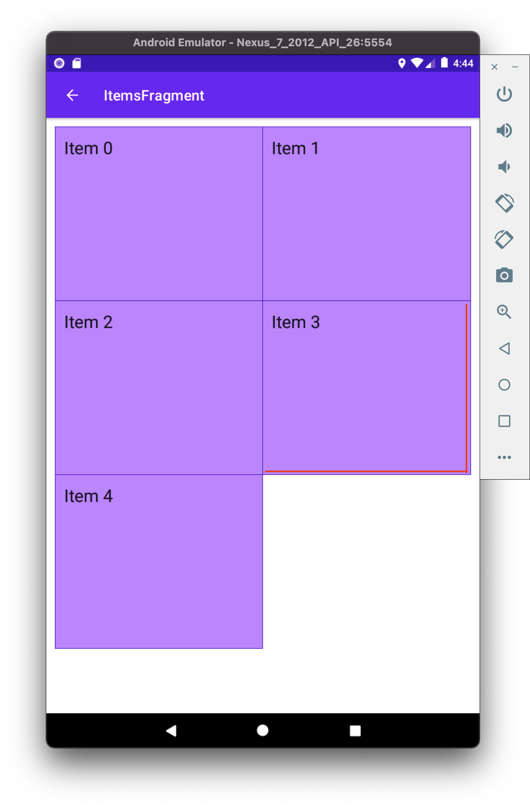
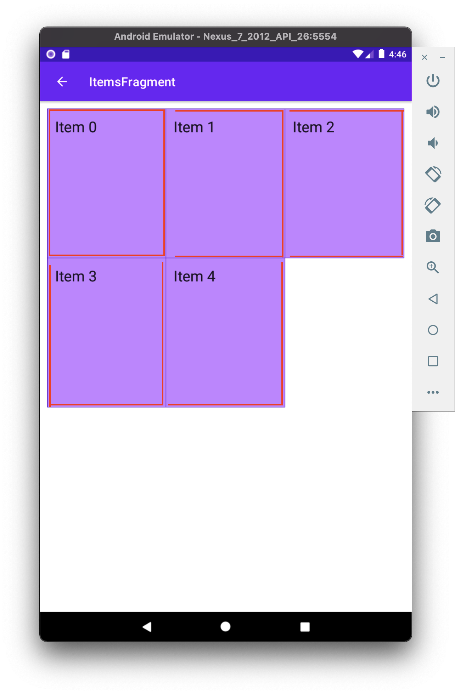

# How to meld item backgrounds together in RecyclerView.Adapter + GridLayoutManager

I don&rsquo;t see many tutorials where you would *get in trouble* when displaying items in a list. But things get dicey when you start to apply a bit more complicated strategies for your use case.

For instance, have you tried using `ConcateAdapter` using adapters in a multiple spans `GridLayoutManager`? Or just simply using a regular `RecyclerView.Adapter` with `GridLayoutManager` to display items with separators instead of paddings?

For the last couple of weeks, I&rsquo;ve seen *quite a bit of adapter implementations*. So I wanted to share some of the take-aways 🤷

In short, my mission was to display items with backgrounds. Little of what I did not notice at first was that background outlines were &rsquo;meld&rsquo; together. This is where the challenge came in.

Oh, and ↗️ [don&rsquo;t forget to check out Github repo for the sample app](https://github.com/marius-m/merged-bg-grid-adapter)!


# Double separator issue

To apply backgrounds to `RecyclerView.Adapter` items are *simple enough*. So, where is the problem?

Well, as always, *it depends*. If you have a list where items are separated, there is no problem.


However, it starts to be an issue whenever the items become much closer. So close, as like having <span class="underline">no padding at all</span>. Then this happens 👇


You get &rsquo;double lines&rsquo; as separators. And this was what I was actually aiming for 👇


How do we solve it? Well, a few solutions come to mind. We either have to <span class="underline">change backgrounds</span> or use <span class="underline">separators</span> that `RecyclerView` supports.


# Using separators (failed attempt)

I&rsquo;ll say from the get-go that this did not work out for me after a couple of tries. If you&rsquo;re here only for the solution, move a bit downward.


## Issue #1

At #1, separators seem like a go-to solution. Even the name tells us as much 🤷.

It may seem to fix our problem, right? Well, **no**. This does not work when trying to use it in `RecyclerView` + `GridLayoutManager`.

The first problem is that &rsquo;separators&rsquo; are applied to the whole `RecyclerView`. So if you have `GridLayoutManager` with a grid span of 2+, it would <span class="underline">use a separator for the entire section</span>.


## Issue #2

Problem #2, when you apply separators, <span class="underline">it applies only in the direction you are separating the items</span>. If you try to modify the `RecyclerView` with `MaterialDividerItemDecoration`, it has no problem when scrolling in provided direction. However, it does if you would try to draw &rsquo;separators&rsquo; in the direction where the items do not scroll.


## Issue #13489579817235

The last nail in the coffin ⚰️ was when or if you&rsquo;re using `ConcatAdapter`. I won&rsquo;t go into too much detail, but this majorly breaks most of what you wanted to achieve.

Even though I could not use separators on my use case, but I can&rsquo;t deny that <span class="underline">it was a good learning experience</span>. [You can even try out using my updated separator if you wish so, as a starting point if you&rsquo;re adventurous enough](https://gist.github.com/marius-m/c8e39761bf054d645b548cd4f63a13c4). It is heavily &rsquo;inspired&rsquo; by `MaterialDividerItemDecoration`.


# Using different backgrounds (success 🙌)

In some sense, this seems a bit counterintuitive and a more complicated solution than it should be. And I still think *this is the case*. However, I did manage to get a working solution, and I&rsquo;m pretty happy about it. At least for now.


## The trick

The whole idea is simple.

-   We provide a different background to a cell, depending on where the cell is.
-   Provide a background line where only it is needed

It is a bit difficult to explain in words, so I&rsquo;ll try to call my drawing superpowers 🦸.


## Drawing Android shapes

Oh, and I almost forgot. **This is how you provide a background using Android shapes**. If you want to control how you draw different backgrounds with provided borders, you&rsquo;ll need this.

-   Declare an xml with a `shape` in `{project}/app/src/main/res/drawable/shape.xml`

```xml
<?xml version="1.0" encoding="utf-8"?>
<layer-list xmlns:android="http://schemas.android.com/apk/res/android">
    <item>
        <shape>
            <padding android:left="1dp" android:top="1dp" android:right="1dp" android:bottom="1dp"/>
            <solid android:color="@color/cardStroke" />
        </shape>
    </item>
    <item>
        <shape>
            <solid android:color="@color/cardBackground" />
        </shape>
    </item>
</layer-list>
```

-   And use that background on any container (`ViewGroup`)

```xml
<?xml version="1.0" encoding="utf-8"?>
<FrameLayout xmlns:android="http://schemas.android.com/apk/res/android"
    xmlns:app="http://schemas.android.com/apk/res-auto"
    xmlns:tools="http://schemas.android.com/tools"
    android:layout_width="match_parent"
    android:layout_height="wrap_content"
    android:background="@drawable/shape_ll_basic">

    <!-- ☝️ Declared background-->

    <... xml content ... />

</FrameLayout>
```


## Moving to the 1st item

It&rsquo;s important to know <span class="underline">where is the first row</span> and <span class="underline">where is the first item in the column</span>. For the first item, we provide a background that has all the corners drawn. Like so.


## Moving to the right 👉

Next, we should define the background for the item next to it. But, because <span class="underline">we already have a left bar in the background, we should append only top, bottom, and right bars</span>. Like so 👇


You&rsquo;re probably starting to *catch the drift* of how we&rsquo;re composing these backgrounds by <span class="underline">only appending bars only where it is needed</span>.

The coolest part about it, if we had more items to the right, we would only need to apply the same background - <span class="underline">top, bottom, and right bars</span>. Like so


## Moving downward👇

Alright. Now that we know how to display the whole row, we need to move downwards.

Once again, the most important thing is to know <span class="underline">which item is first</span>. As we know, this is not the first row, and we already have a top bar. So, what we need are <span class="underline">left, right, and bottom bars</span>.


And the rest of the items on the right would require only <span class="underline">left and bottom, as we already have top and left bars</span>.



And this works really well for the rest of the items as well if we would provide more items in the grid 👇




## The code

Now that we know the basic premise of what we&rsquo;re aiming for let us see how we implement the `RecyclerView.Adapter`. The coolest part is that there is not much logic here. As stated before, we only need to figure out

-   Is the item in the first row

```kotlin
private fun isItemInFirstRow(pos: Int): Boolean {
    return pos <= gridSpanSize - 1
}
```

-   Is the item first in column

```kotlin
private fun isItemInFirstColumn(pos: Int): Boolean {
    return pos % gridSpanSize == 0
}
```

The rest of the adapter looks nothing out of ordinary.

```kotlin
class MergeAdapter<T : BasicAdapterItem>(
    private val gridSpanSize: Int,
    private val itemClickListener: ((BasicAdapterItem) -> Unit)? = null,
) : RecyclerView.Adapter<MergeAdapterViewHolder<T>>(), ItemBoundableAdapter<T> {

    override var items: List<T> by Delegates.observable(emptyList()) { _, oldList, newList ->
        autoNotify(oldList, newList) { o, n -> o.id == n.id }
    }

    override fun onCreateViewHolder(
        viewGroup: ViewGroup,
        viewType: Int
    ): MergeAdapterViewHolder<T> {
        return MergeAdapterViewHolder.create(viewGroup)
    }

    override fun onBindViewHolder(
        holder: MergeAdapterViewHolder<T>,
        position: Int,
    ) {
        val isItemInFirstRow = isItemInFirstRow(position)
        val isItemInFirstColumn = isItemInFirstColumn(position)
        val item = items[position]
        holder.bind(
            isItemInFirstRow,
            isItemInFirstColumn,
            item,
            itemClickListener
        )
    }

    /**
     * @return item position is in the first row
     */
    private fun isItemInFirstRow(pos: Int): Boolean {
        return pos <= gridSpanSize - 1
    }

    /**
     * @return item position is in the first column, when on different rows
     */
    private fun isItemInFirstColumn(pos: Int): Boolean {
        return pos % gridSpanSize == 0
    }

    override fun getItemCount(): Int = items.size
}
```

Now we provide the resolved properties to the `ViewHolder` to draw items.

-   Snippet to apply the background

```kotlin
 /**
 * Provides diff background based on item position in the grid
 * @param isFirstRow item is in the first row of the grid
 * @param isFirstColumn item is in the first column of the row
 */
@DrawableRes
private fun bgResourceByPosition(
    isFirstRow: Boolean,
    isFirstColumn: Boolean,
): Int {
    return when {
        isFirstRow && isFirstColumn -> R.drawable.shape_ll_merge_row_column_first
        isFirstRow && !isFirstColumn -> R.drawable.shape_ll_merge_row_column_last
        isFirstColumn -> R.drawable.shape_ll_merge_column_first
        else -> R.drawable.shape_ll_merge_column_last
    }
}
```

-   Rest of the `ViewHolder` is nothing out of ordinary

```kotlin
class MergeAdapterViewHolder<T : BasicAdapterItem>(
    private val binding: ItemMergedBinding,
) : RecyclerView.ViewHolder(binding.root) {

    fun bind(
        isFirstRow: Boolean,
        isFirstColumn: Boolean,
        item: T,
        itemClickListener: ((T) -> Unit)?
    ) {
        val viewClickListener = toViewClickListenerOrNull(item, itemClickListener)
        binding.root.setOnClickListener(viewClickListener)
        binding.title.text = item.title
        binding.root.setBackgroundResource(bgResourceByPosition(isFirstRow, isFirstColumn))
    }

    /**
     * Provides diff background based on item position in the grid
     * @param isFirstRow item is in the first row of the grid
     * @param isFirstColumn item is in the first column of the row
     */
    @DrawableRes
    private fun bgResourceByPosition(
        isFirstRow: Boolean,
        isFirstColumn: Boolean,
    ): Int {
        return when {
            isFirstRow && isFirstColumn -> R.drawable.shape_ll_merge_row_column_first
            isFirstRow && !isFirstColumn -> R.drawable.shape_ll_merge_row_column_last
            isFirstColumn -> R.drawable.shape_ll_merge_column_first
            else -> R.drawable.shape_ll_merge_column_last
        }
    }

    companion object {
        fun <T : BasicAdapterItem> create(viewGroup: ViewGroup): MergeAdapterViewHolder<T> {
            return MergeAdapterViewHolder(
                binding = ItemMergedBinding.inflate(
                    LayoutInflater.from(viewGroup.context),
                    viewGroup,
                    false
                )
            )
        }
    }
}
```

As always, if the code snippets are not enough, [check out the sample app on Github and try it yourself](https://github.com/marius-m/merged-bg-grid-adapter)! It has basic adapters, adapters with paddings, and merged background adapters (what we were trying to do here) to try out 💪.


# Using LayoutManager

What about using `LinearLayoutManager`? Is this still relevant? It could be if you wanted to 🤷 However there seems to be better ways of solving this.

1.  Apply a background to the whole `RecyclerView` with all the corners bars
2.  Apply `ItemDecorator` separator for the items to be split

And you should be good to go.

However I&rsquo;m not entirely sure this&rsquo;ll work when using `ConcatAdapter` 🤔


# Ending notes

Now. This is not exactly *rocket science* for sure. However, I did not think twice when picking up the task. By starting to dig deeper, I have realized how many parts I need to figure out first for the designs to be accurate.

Hopefully, this will be useful for you as well, and you won&rsquo;t need to spend so much time as I did 🤷🚀.
